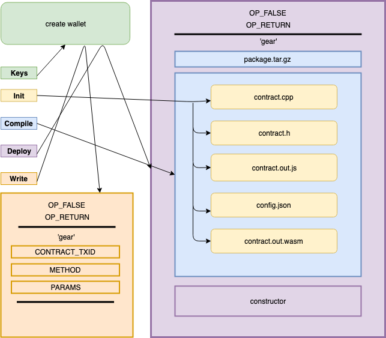

# ⚙️ Gear SDK
___
## Gear: smart contracts on bitcoin


<button name="button"  
  style="background-color: #00FF00;"
  onclick="window.location.href='https://github.com/gear-sv/gear-contracts'">
  GEAR CONTRACTS
</button>
<button name="button"
  style="background-color: #00FF00;"
  onclick="window.location.href='https://github.com/gear-sv/gear-nano'">
  GEAR NANO
</button>
<button name="button"  
  style="background-color: #00FF00;"
  onclick="window.location.href='https://gear.computer'">
  GEAR COMPUTER
</button>
<button name="button"  
  style="background-color: #00FF00;"
  onclick="window.location.href='https://medium.com/@_seanavery/gearsv-smart-contracts-for-bitcoin-68ee92a2e66e'">
  BLOG
</button>

___

## Introduction

### what?
   

```
Gear is general purpose computation engine that runs on top of bitcoin.
This means you can create an immortal piece of code whose state is 100% auditable.

The Gear SDK lets your write arbitrary programs, publish them to the blockchain,
and handle reads and writes to those files.

Although the sdk currently only supports C++,
it can be extended to handle Python, Go, Rust, C, and much more.
```

### how?
```
1. Bitcoin as the consensus engine, payment system, and write interface.
1. Web Assembly as the compilation target.
2. Planaria to scrape the blockchain and update contract state.
3. Planarium to store state to disk and serve over HTTP.
```

### why?

```
Ethereum and other smart contracting blockchains have failed to scale
or provide any tangible benefits over the bitcoin blockchain itself.
We are building a smart contract platform
the way it should have been built the first time. On top of bitcoin.

We want to take MetaNet to the next level
by turning it from a distributed filesystem
into a distributed operating system.
We are moving up the stack from simple hard drive storage
to actual actual cpu/memory computation.

All running natively on bitcoin, ... sv.
```
___

## Gear Contracts

```
Compile, test, and deploy contracts to bitcoin.
```
<p align="left">
  

<button name="button"  
  style="background-color: #00FF00;"
  onclick="window.location.href='https://github.com/gear-sv/gear-contracts'">
  GEAR CONTRACTS
</button>


### Install

```
npm i gear-contracts -g
```

### API

#### `gear-contracts init`
```
1. Choose your project configs. Saves to a local package.json file.
2. Choose contracts you want to start working with.
3. Creates .cpp and .h files for the chosen contracts.
```

#### `gear-contracts keys`
```
1. Generates a bitcoin keypair [privateKey, publicKey, address] to keys.json file.
2. Saves qr code of address to address.png file.
```

#### `gear-contracts compile`
```
Compiles the contract files into a web assembly binary
[contractName].out.wasm file, and the Emscripten embind javascript interface
[contractName].out.js file

Files are written to ./output directory.
```

#### `gear-contracts test`
```
Calls the test file for the contract in ./tests

Uses the tape testing framework which comes bundled with the global install.
```


***MAKE SURE YOUR KEY IS FUNDED BEFORE PROCEEDING.***

*Contract packages are around 30 kb. 10 cents should be enough.*
#### `gear-contracts deploy`
```
1. Creates a tempory ./tmp directory to hold contract package.
2. Moves .h, .cpp, .json, and .js files into the temporary folder
3. Compresses package into a gziped tarball [contractName].tar.gz
5. Asks for constructor inputs if applicable.
6. Formats op_return transaction with [gear, contract.tar.gz, constructor].
7. Broadcasts transaction to the bitcoin chain. Returns transaction hash

THE TRANSACTION HASH IS NOW ALS0 YOUR NEW CONTRACT ID
```
___
## Gear Nano


<button name="button"
  style="background-color: #00FF00;"
  onclick="window.location.href='https://github.com/gear-sv/gear-nano'">
  GEAR NANO
</button>

### Setup

```
npm i gear-nano -g
```

```
npm i pm2 -g
```

### API

#### `gear-nano init [contractID]`

```
gear-nano init 6787dfa742f963c6641e901d8e81da2930d62820b7837b7fd1e28c7bbf394727
```

```
1. Fetches contract package tar ball from the on chain transaction. `contractID` is the transaction hash of the contract deployment.
2. Fetches the `blockHeight` from the transaction.
3. Fetches the `constructor` input from the transaction.
```

#### `gear-nano processor`

```
1. Converts emscripten module [contractName].out.js and wasm bytecode file [contractName].out.wasm into a single javascript Module.
2. Initializes contract with the constructor input from deployement.
3. Starts Bitbus and Neon Planaria scraping servers which filter for contract calls pointed at the contractID.
4. Initializes contract inside the WASM virtual machine runtime.
5. Starts block handler that aggregates contract calls and feeds into the contract.
```

#### `gear-nano state`

```
1. Starts Planarium server which accepts state updates from the processor over ZeroMQ.
2. Starts Http server which allows you to query the state at a given block height.
```

#### `gear-nano transactions`

```
1. Starts Planarium server which accepts state updates from the processor over ZeroMQ.
2. Starts Http server which allows you to query a transaction by the transaction hash.
```

#### `gear-nano clear`

```
1. Clears the server state by deleting `StateDB`, `TxDB` and `tape.txt`.
```
___

## Contracts

### `Chain Variables`
The "contract" is just a pure c++ class, as easy as that. The only difference are special key words input parameters that can use information verified by the chain.

`SENDER`
 The bitcoin address verified in script by the on chain transaction.

`BLOCK_HEIGHT`
The height of the block in which the transaction was processed.

`BLOCK_TIMESTAMP`
The timestamp of the block in which the transaction was processed.

### `Header File`

```
Just as you normally do with c++ code,
this is where you define the interface to your program.
This will include the class instantiation
along with the class level variables and functions.
```

```c++
#include <string>
#include <map>

class FungibleToken {
  public:
    unsigned int supply;
    std::string owner;
    std::map<std::string, unsigned int> balances;

    FungibleToken(std::string owner);

    const std::string& setOwner(std::string SENDER, std::string newOwner);
    const std::string& mint(std::string SENDER, unsigned int amount);
    const std::string& transfer(std::string SENDER, std::string recipient, unsigned int amount);

    const unsigned int& getSupply();
    const std::string& getOwner();
    const unsigned int& getBalance(std::string address);
    const std::map<std::string, unsigned int>& getBalances();
};

```

### `CPP File`

```
This is where you put the implementation of the different functions.
These functions can modify the state variables which will be queryable via gear-nano.

Currently the framework only provides support for c++11 and the std library.
```

### `Emscripten Embind`
```
Emscripten's embind pattern is used to export a javascript class
that maps one to one with the underlying c++ class.
This allows for a seamless bridge between planaria and your contract.
```

```c++
EMSCRIPTEN_BINDINGS(FungibleToken_example) {
  register_vector<string>("keys");
  register_map<string, unsigned int>("balances");
  class_<FungibleToken>("FungibleToken").constructor<string>()
    .function("setOwner", &FungibleToken::setOwner)
    .function("mint", &FungibleToken::mint)
    .function("transfer", &FungibleToken::transfer)
    .function("getSupply", &FungibleToken::getSupply)
    .function("getOwner", &FungibleToken::getOwner)
    .function("getBalance", &FungibleToken::getBalance)
    .function("getBalances", &FungibleToken::getBalances);
 }
```

### `JSON ABI`

```
Until we get our act together and engineer a js based c++ parser,
you will have to manually create the abi as a json [contractName].json file.
```

```json
{
  "constructor": {
    "owner": "string"
  },
  "setters": {
    "setOwner": {
      "SENDER": "string",
      "newOwner": "string"
    },
    "mint": {
      "SENDER": "string",
      "amount": "int"
    },
    "transfer": {
      "SENDER": "string",
      "recipient": "string",
      "amount": "int"
    }
  },
  "getters": {
    "getSupply": {
      "returns": "int"
    },
    "getOwner": {
      "returns": "string"
    },
    "getBalances": {
      "returns": "map"
    }
  }
}
```

### FungibleToken

#### `constructor`

```c++
FungibleToken::FungibleToken(string owner) {
  this->supply = 0;
  this->owner = owner;
}
```

#### `setOwner`

```c++
const string& FungibleToken::setOwner(string SENDER, string newOwner) {
  // check that SENDER is the current owner
  if (SENDER != this->owner) {
    return "fail";
  }

  this->owner = newOwner;
  return "pass";
}
```

#### `mint`

```c++
const string& FungibleToken::mint(string SENDER, unsigned int amount) {
  // only the owner can mint
  if (SENDER != this->owner) {
    return "fail";
  }

  // mint tokens, assign to owner
  this->supply = this->supply + amount;

  // increment owner balance
  if (this->balances.find(SENDER) == this->balances.end()) {
    this->balances.insert(pair<string, unsigned int>(SENDER, amount));
  } else {
    unsigned int balance = this->balances[SENDER];
    this->balances[SENDER] = balance + amount;
  }

  return "pass";
}

```


#### `transfer`

```c++
const string& FungibleToken::transfer(string SENDER, string recipient, unsigned int amount) {
  // check if SENDER has sufficient funds
  if (this->balances[SENDER] < amount) {
    return "fail";
  }

  // increment recipient balance
  if (this->balances.find(recipient) == this->balances.end()) {
    this->balances.insert(pair<string, unsigned int>(recipient, amount));
  } else {
    unsigned int recipientBalance = this->balances[recipient];
    this->balances[recipient] = recipientBalance + amount;
  }

  // decrement SENDER balance
  int senderBalance = this->balances[SENDER];
  this->balances[SENDER] = senderBalance - amount;

  return "pass";
}

```

#### `getters`


```c++
const unsigned int& FungibleToken::getSupply() {
  return this->supply;
}

const string& FungibleToken::getOwner() {
  return this->owner;
}

const unsigned int& FungibleToken::getBalance(string address) {
  return this->balances[address];
}

const map<string, unsigned int>& FungibleToken::getBalances() {
  return this->balances;
}
```
